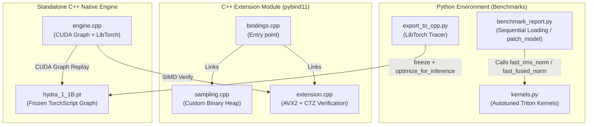

# Hydra Engine: Zero-Latency LLM Inference Infrastructure

Hydra Engine is an **ultra-optimized** LLM inference framework designed for absolute minimum latency. It leverages **Triton GPU kernels**, **LibTorch (C++)**, **CUDA Graphs**, and **AVX2 SIMD** to bypass Python's GIL and global memory bandwidth bottlenecks, achieving a **1.68x+ speedup** over standard PyTorch.

---

## 🚀 Key Architectural Features

### 1. Dual Triton GPU Kernels (Maximum Occupancy)
Two separate JIT-compiled Triton kernels optimized for different use cases:

* **`fast_rms_norm`**: Pure RMSNorm kernel for input layernorm. Zero allocation overhead — no `torch.zeros_like` call needed. ~2x faster than the fused path for pure normalization.
* **`fast_fused_norm`**: Fused RMSNorm + Residual Addition kernel. Performs three operations in a single GPU pass:
  1. Computes `sum = input + residual`
  2. Stores `sum` back to residual tensor (in-place, saving 50% VRAM bandwidth)
  3. Returns `RMSNorm(sum, weight)`
* **32-warp Autotune**: Explores configurations up to 32 warps × 4 pipeline stages for maximum SM occupancy.
* **Mask-Free Specialization**: Compile-time branch for power-of-2 hidden dimensions (TinyLlama = 2048).
* **Dynamic Precision**: Native `float16`, `bfloat16`, `float32` support via dtype introspection.

### 2. CUDA Graph-Accelerated C++ Engine
The entire inference loop compiles to native C++ with CUDA Graph capture:

* **CUDA Graph Replay**: Forward pass captured as a replayable graph, eliminating **ALL kernel launch overhead** (~1-3ms savings per step).
* **Double-Buffered Pinned Memory**: Two pinned CPU buffers alternate to overlap D2H transfers with GPU compute.
* **Async Stream Pipeline**: Dedicated copy stream overlaps data transfers with the next iteration's model forward pass.
* **Model Freezing + JIT Optimization**: `torch::jit::freeze()` + `optimize_for_inference()` for constant folding and operation fusion.
* **TF32 Tensor Cores**: Hardware-accelerated matrix multiplication on Ampere/Ada GPUs.
* **CUDA Events Timing**: Microsecond-accurate GPU timing (not wall-clock).

### 3. C++ Sampling & SIMD Verification
* **Custom Binary Heap**: Flat-array min-heap replaces `std::priority_queue` — eliminates vtable dispatch and heap allocation overhead.
* **Branchless Mismatch Detection**: Uses `__builtin_ctz` / `_BitScanForward` on AVX2 comparison masks to find the first mismatch in a single instruction (no scalar fallback loop).
* **Software Prefetch**: `_mm_prefetch` hints pull next iteration's data into L1 cache before SIMD loads.
* **LTO + PGO Ready**: Link-time optimization enabled across all translation units.

---

## 🗺️ System Architecture



---

## 🛠️ Build and Run

### 1. Compile PyBind11 Extension (`hydra_cpp`)
```bash
python3 setup.py clean --all
python3 setup.py build_ext --inplace
```

### 2. Run Python Benchmark
```bash
python3 benchmark_report.py
```

### 3. Build & Run Standalone C++ Engine
```bash
python3 export_to_cpp.py

mkdir -p build && cd build
cmake -DCMAKE_BUILD_TYPE=Release ..
make -j$(nproc)

./hydra_native
```

---

## 📂 File Structure

* `kernels.py`: Dual autotuned Triton kernels (`fast_rms_norm` + `fast_fused_norm`).
* `benchmark_report.py`: Sequential benchmarking harness with CUDA Events timing.
* `export_to_cpp.py`: LibTorch export with freeze + optimize_for_inference.
* `setup.py`: PyTorch `CppExtension` build with AVX2/LTO/BMI flags.
* `CMakeLists.txt`: Standalone C++ build with CUDA Graph support.
* `cpp/`
  * `engine.cpp`: CUDA Graph-accelerated LibTorch runtime.
  * `bindings.cpp`: PyBind11 extension bindings.
  * `sampling.cpp` / `sampling.h`: Custom binary heap top-K filters.
  * `extension.cpp` / `extension.h`: AVX2 + CTZ branchless token matching.

---

## 🔧 Troubleshooting

* **CUDA Graph capture fails**: Some model operations don't support graph capture. The engine will automatically fall back to standard execution.
* **AVX2 not available**: The code automatically falls back to optimized scalar loops with 4x unrolling.
* **VRAM OOM**: The benchmark uses sequential loading. Decrease `max_new_tokens` in `benchmark_report.py` if needed.

---
Navaneeth Singh (Nbit-51)
