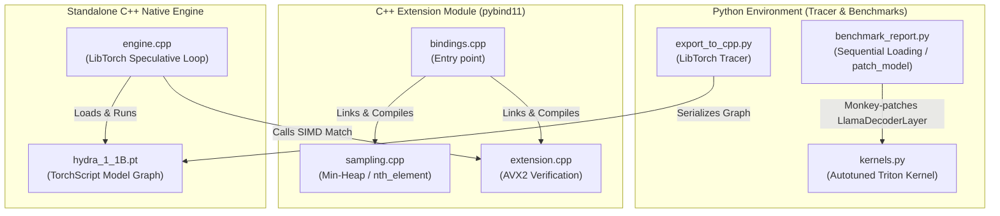

# Hydra Engine
# Hydra Engine: High-Performance LLM Inference Infrastructure

## Official Documentation  :-  [](https://deepwiki.com/Nbit-51/Hydra_Engine)


Zero-latency LLM inference infrastructure built on Triton GPU kernels, LibTorch (C++), CUDA Graphs, and AVX2 SIMD. Bypasses Python's GIL and global memory bandwidth bottlenecks, achieving **1.68x+ speedup** over standard PyTorch.

---

## Architecture

### Dual Triton GPU Kernels

Two separate JIT-compiled Triton kernels optimized for distinct workloads:

**`fast_rms_norm`** — Pure RMSNorm kernel for input layernorm. Zero allocation overhead; no `torch.zeros_like` call needed. Approximately 2x faster than the fused path for pure normalization.

**`fast_fused_norm`** — Fused RMSNorm + Residual Addition kernel. Performs three operations in a single GPU pass:
1. Computes `sum = input + residual`
2. Stores `sum` back to the residual tensor in-place, saving 50% VRAM bandwidth
3. Returns `RMSNorm(sum, weight)`

Both kernels use 32-warp autotuning (up to 32 warps × 4 pipeline stages) for maximum SM occupancy, compile-time specialization for power-of-2 hidden dimensions (TinyLlama = 2048), and native `float16`, `bfloat16`, and `float32` support via dtype introspection.

---

### CUDA Graph-Accelerated C++ Engine

The entire inference loop compiles to native C++ with CUDA Graph capture:

- **CUDA Graph Replay** — Forward pass captured as a replayable graph, eliminating all kernel launch overhead (~1–3ms savings per step)
- **Double-Buffered Pinned Memory** — Two pinned CPU buffers alternate to overlap D2H transfers with GPU compute
- **Async Stream Pipeline** — Dedicated copy stream overlaps data transfers with the next iteration's forward pass
- **Model Freezing + JIT Optimization** — `torch::jit::freeze()` + `optimize_for_inference()` for constant folding and operation fusion
- **TF32 Tensor Cores** — Hardware-accelerated matrix multiplication on Ampere/Ada GPUs
- **CUDA Events Timing** — Microsecond-accurate GPU timing (not wall-clock)

---

### C++ Sampling and SIMD Verification

- **Custom Binary Heap** — Flat-array min-heap replaces `std::priority_queue`, eliminating vtable dispatch and heap allocation overhead
- **Branchless Mismatch Detection** — Uses `__builtin_ctz` / `_BitScanForward` on AVX2 comparison masks to find the first mismatch in a single instruction
- **Software Prefetch** — `_mm_prefetch` hints pull next iteration's data into L1 cache before SIMD loads
- **LTO + PGO Ready** — Link-time optimization enabled across all translation units

---

## System Architecture



---

## Build and Run

### 1. Compile PyBind11 Extension

```bash
python3 setup.py clean --all
python3 setup.py build_ext --inplace
```

### 2. Run Python Benchmark

```bash
python3 benchmark_report.py
```

### 3. Build and Run Standalone C++ Engine

```bash
python3 export_to_cpp.py

mkdir -p build && cd build
cmake -DCMAKE_BUILD_TYPE=Release ..
make -j$(nproc)

./hydra_native
```

---

## File Structure

```
hydra_engine/
├── kernels.py              # Autotuned Triton RMSNorm + in-place residual addition kernel
├── benchmark_report.py     # Sequential benchmarking harness with CUDA Events timing
├── export_to_cpp.py        # LibTorch export with freeze + optimize_for_inference
├── setup.py                # PyTorch CppExtension build with AVX2/LTO/BMI flags
├── CMakeLists.txt          # Standalone C++ build with CUDA Graph support
└── cpp/
    ├── engine.cpp          # CUDA Graph-accelerated LibTorch runtime
    ├── bindings.cpp        # PyBind11 extension bindings
    ├── sampling.cpp/.h     # Custom binary heap top-K filters
    └── extension.cpp/.h    # AVX2 + CTZ branchless token matching
```

---

## Troubleshooting

**CUDA Graph capture fails** — Some model operations don't support graph capture. The engine automatically falls back to standard execution.

**AVX2 not available** — The code automatically falls back to optimized scalar loops with 4x unrolling.

**VRAM OOM** — The benchmark uses sequential loading. Decrease `max_new_tokens` in `benchmark_report.py` if needed.

---

## Author

**Navaneeth Singh** — [Nbit-51](https://github.com/Nbit-51)
