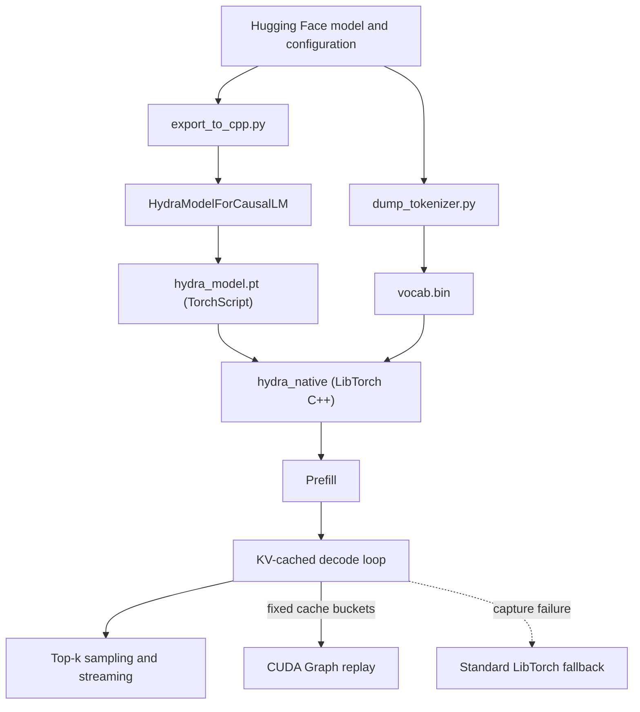

# Hydra Engine

High-performance, general-purpose LLM inference with a custom PyTorch model export path and a native LibTorch C++ decode runtime.

[](https://deepwiki.com/Nbit-51/Hydra_Engine)
[](https://github.com/Nbit-51/Hydra_Engine/actions/workflows/ci.yml)

## Validated Performance

Before CUDA Graph integration, the general-purpose engine was approximately **1.46-1.48x faster than eager PyTorch autoregressive decoding** on the tested configuration.

| Configuration | Result |
| --- | ---: |
| Model | Qwen2.5-0.5B |
| GPU | NVIDIA RTX 4050 Laptop GPU |
| Environment | WSL2, CUDA, LibTorch |
| Hugging Face eager PyTorch | 39.86 tokens/s |
| Hydra Engine | 58.3 tokens/s |
| Measured speedup | 1.46x |

Results vary with the model, GPU, prompt length, sampling settings, software versions, and thermal state. The earlier **1.68x+** figure was based on an older TinyLlama-specific path and is not presented as the current general-purpose result. TinyLlama and additional model families still need fresh, like-for-like validation.

The first seeded CUDA Graph validation on the same RTX 4050 decoded 64 tokens at **135.14 tokens/s**, compared with **55.80 tokens/s** through Hydra's standard LibTorch path (`2.42x` internal speedup). This is a development measurement, not yet a replacement for the PyTorch comparison above; repeated trials and a matching end-to-end PyTorch workload are still required before publishing a new headline number.

## How It Works

Hydra exports supported Hugging Face causal language models into a TorchScript module with a decode-oriented execution path. The native C++ runtime loads that module through LibTorch and performs prefill, token-by-token decode, top-k sampling, and token streaming without a Python loop.

Current performance work includes:

- Preallocated key/value caches reused across decode steps.
- Attention over the actual cache length instead of the model's full maximum context window.
- Host-tracked cache length, avoiding an unnecessary GPU-to-CPU synchronization each token.
- Native LibTorch execution with TF32 enabled on supported NVIDIA GPUs.
- Warmup before decode timing to reduce JIT and library initialization noise.
- Model configuration extracted from Hugging Face rather than hard-coded for TinyLlama.

## CUDA Graph Status

Decode now supports reusable CUDA Graphs through power-of-two KV-cache buckets. Each bucket keeps the captured tensor shapes fixed, while a GPU-side mask excludes cache entries beyond the current token position. The engine pre-captures only the buckets required for the requested generation length and rebuilds a clean prefill state before timed decode.

The `cuda_graphs` command-line argument selects the policy:

- `auto` (default): attempt graph execution in an isolated process; if capture fails, start a clean standard LibTorch decode. Isolation is required because a failed LibTorch capture can leave that CUDA process unsafe to reuse.
- `off`: skip capture and use standard LibTorch decode.
- `required`: fail the run if any required bucket cannot be captured. This is the verification mode for benchmarks claiming CUDA Graph acceleration.

The runtime prints its selected path. CUDA Graph performance must only be reported when the output says `[cuda-graph] enabled`.

## AVX2 Status

The speculative-token verifier has separate scalar and AVX2 implementations with native correctness tests. CI verifies the scalar implementation everywhere and the AVX2 implementation on compatible x86-64 runners.

It is **not integrated into the active native decode path** because Hydra does not yet implement speculative decoding and therefore has no draft/target token pair to verify. Moving ordinary GPU logits to the CPU solely to invoke AVX2 would add latency. AVX2 does not contribute to the performance result above.

## Architecture



The historical Python/Triton benchmark and the optional PyBind11 sampling extension are separate from the active C++ inference path.

## Build and Run

### 1. Install Python dependencies

```bash
python3 -m pip install -r requirements.txt
```

### 2. Export a model and tokenizer

Qwen2.5-0.5B is the currently validated default:

```bash
python3 export_to_cpp.py --model_id "Qwen/Qwen2.5-0.5B"
python3 dump_tokenizer.py --model_id "Qwen/Qwen2.5-0.5B"
```

This produces `hydra_model.pt` and `vocab.bin`.

### 3. Build the native runtime

```bash
export CUDA_HOME="${CUDA_HOME:-/usr/local/cuda}"
export PATH="$CUDA_HOME/bin:$PATH"
export CUDACXX="$CUDA_HOME/bin/nvcc"

cmake -S . -B build \
  -DCMAKE_BUILD_TYPE=Release \
  -DCMAKE_PREFIX_PATH="$(python3 -c 'import torch.utils; print(torch.utils.cmake_prefix_path)')" \
  -DCUDAToolkit_ROOT="$CUDA_HOME" \
  -DCMAKE_CUDA_COMPILER="$CUDACXX"
cmake --build build -j
```

If an existing build directory still references an old CUDA compiler such as `/usr/bin/nvcc`, configure a fresh build directory (for example, `build-feature`) with the same options.

### 4. Run inference

The native binary accepts a comma-separated tokenized prompt:

```bash
./build/hydra_native hydra_model.pt vocab.bin "785,6722,315,9625,374" 64 auto
```

The example IDs represent `The capital of France is` for the Qwen tokenizer. Token IDs are tokenizer-specific and must not be reused across model families.

For a reproducible graph/off comparison, provide the same optional seed to both runs:

```bash
./build/hydra_native hydra_model.pt vocab.bin "785,6722,315,9625,374" 64 required 1234
./build/hydra_native hydra_model.pt vocab.bin "785,6722,315,9625,374" 64 off 1234
```

## Validation

Every push to `main` or a `feature/**` branch and every pull request runs the GitHub Actions CI workflow. It checks active Python files for syntax errors and runs a CPU smoke test covering prefill, KV-cache decode, cache reset, and TorchScript compilation. The CI badge at the top of this README links to the latest result.

CI also compiles and runs the standalone token-verification suite in scalar mode and, when supported by the runner CPU, AVX2 mode. Native CMake builds expose the same suite through `ctest --output-on-failure`.

Full CUDA evaluation is available through the manual **GPU Evaluation** workflow. It requires a self-hosted Linux runner labeled `self-hosted`, `linux`, `x64`, and `gpu`; GitHub-hosted runners do not provide the NVIDIA environment needed to export and execute Hydra.

Run the general-purpose model harness:

```bash
python3 test_models.py
```

Run the eager PyTorch baseline separately:

```bash
python3 profile_baseline.py
```

For credible comparisons, use the same model, dtype, prompt/decode lengths, sampling behavior, GPU, and software environment. Report prefill and decode separately when possible.

## Repository Layout

```text
Hydra_Engine/
|-- hydra_config.py       # Hugging Face configuration adapter
|-- hydra_model.py        # Exportable model and KV-cache implementation
|-- export_to_cpp.py      # Weight loading, validation, and TorchScript export
|-- dump_tokenizer.py     # Binary vocabulary export for the C++ streamer
|-- profile_baseline.py   # Eager PyTorch decode baseline
|-- test_models.py        # Multi-model validation harness
|-- CMakeLists.txt        # Native LibTorch build
|-- cpp/
|   |-- engine.cpp        # Prefill, graph/fallback decode, sampling, streaming
|   |-- simd_verify.cpp   # Torch-independent scalar/AVX2 token verification
|   `-- extension.cpp     # Optional PyTorch wrapper for token verification
|-- tests/                # CPU model and native SIMD correctness tests
`-- archive/              # Isolated TinyLlama/Triton research path
```

## Known Limitations

- Model-family support is still being expanded and must be validated individually.
- CUDA Graph capture remains model- and operation-dependent; `auto` falls back and `required` verifies it.
- The verified AVX2 token matcher is not wired into active inference until speculative decoding exists.
- The Triton RMSNorm path is isolated under `archive/` and is not part of the current performance result.
- Sampling still requires a host-visible token each decode step.

## Author

**Navaneeth Singh** - [Nbit-51](https://github.com/Nbit-51)
