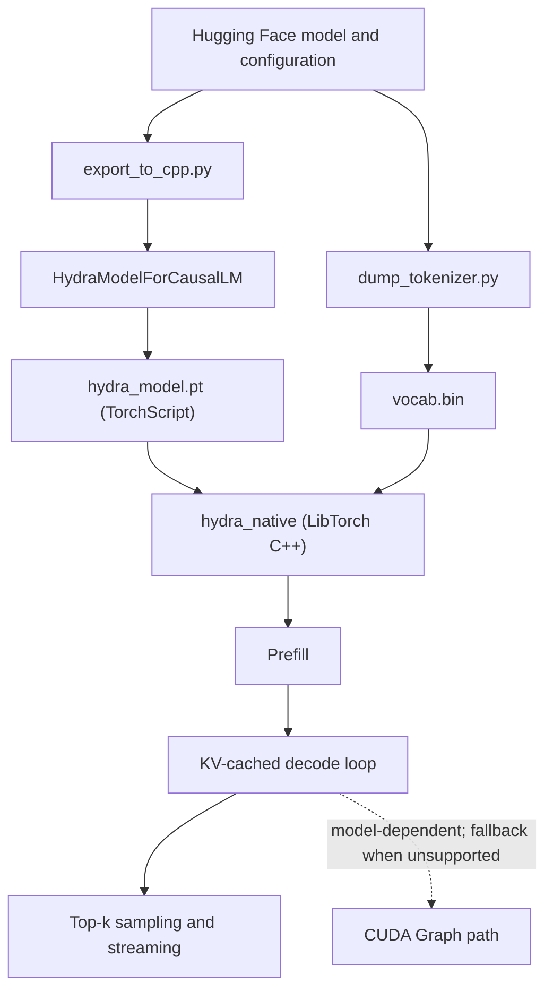

# Hydra Engine

High-performance, general-purpose LLM inference with a custom PyTorch model export path and a native LibTorch C++ decode runtime.

[](https://deepwiki.com/Nbit-51/Hydra_Engine)

## Current Performance

The current validated implementation is approximately **1.46-1.48x faster than eager PyTorch autoregressive decoding** on the tested configuration.

| Configuration | Result |
| --- | ---: |
| Model | Qwen2.5-0.5B |
| GPU | NVIDIA RTX 4050 Laptop GPU |
| Environment | WSL2, CUDA, LibTorch |
| Hugging Face eager PyTorch | 39.86 tokens/s |
| Hydra Engine | 58.3 tokens/s |
| Measured speedup | 1.46x |

Results vary with the model, GPU, prompt length, sampling settings, software versions, and thermal state. The earlier **1.68x+** figure was based on an older TinyLlama-specific path and is not presented as the current general-purpose result. TinyLlama and additional model families still need fresh, like-for-like validation.

## How It Works

Hydra exports supported Hugging Face causal language models into a TorchScript module with a decode-oriented execution path. The native C++ runtime loads that module through LibTorch and performs prefill, token-by-token decode, top-k sampling, and token streaming without a Python loop.

Current performance work includes:

- Preallocated key/value caches reused across decode steps.
- Attention over the actual cache length instead of the model's full maximum context window.
- Host-tracked cache length, avoiding an unnecessary GPU-to-CPU synchronization each token.
- Native LibTorch execution with TF32 enabled on supported NVIDIA GPUs.
- Warmup before decode timing to reduce JIT and library initialization noise.
- Model configuration extracted from Hugging Face rather than hard-coded for TinyLlama.

## CUDA Graph Status

CUDA Graph compatibility is model-dependent. Operations with dynamic shapes or host-visible scalar conversions may prevent graph capture. When capture is unavailable, inference uses the standard LibTorch execution path instead of failing the entire run.

The checked-in general-purpose runtime currently relies on that standard path while CUDA Graph coverage is expanded and validated model by model. CUDA Graph acceleration therefore must not be assumed for every model or included in benchmark claims unless the run explicitly reports successful capture and replay.

## AVX2 Status

The repository contains an experimental PyBind11 extension with AVX2 token-verification utilities. It is **not integrated into the active native decode path** and does not contribute to the performance result above. AVX2 is therefore not advertised as a current engine acceleration feature.

## Architecture



The archived Python/Triton benchmark and the optional PyBind11 sampling extension are separate from the active C++ inference path.

## Build and Run

### 1. Install Python dependencies

```bash
python3 -m pip install -r requirements.txt
```

### 2. Export a model and tokenizer

Qwen2.5-0.5B is the currently validated default:

```bash
python3 export_to_cpp.py --model_id "Qwen/Qwen2.5-0.5B"
python3 dump_tokenizer.py --model_id "Qwen/Qwen2.5-0.5B"
```

This produces `hydra_model.pt` and `vocab.bin`.

### 3. Build the native runtime

```bash
export CUDA_HOME="${CUDA_HOME:-/usr/local/cuda}"
export PATH="$CUDA_HOME/bin:$PATH"
export CUDACXX="$CUDA_HOME/bin/nvcc"

cmake -S . -B build \
  -DCMAKE_BUILD_TYPE=Release \
  -DCMAKE_PREFIX_PATH="$(python3 -c 'import torch.utils; print(torch.utils.cmake_prefix_path)')" \
  -DCUDAToolkit_ROOT="$CUDA_HOME" \
  -DCMAKE_CUDA_COMPILER="$CUDACXX"
cmake --build build -j
```

If an existing build directory still references an old CUDA compiler such as `/usr/bin/nvcc`, configure a fresh build directory (for example, `build-feature`) with the same options.

### 4. Run inference

The native binary accepts a comma-separated tokenized prompt:

```bash
./build/hydra_native hydra_model.pt vocab.bin "785,6722,315,9625,374" 64
```

The example IDs represent `The capital of France is` for the Qwen tokenizer. Token IDs are tokenizer-specific and must not be reused across model families.

## Validation

Run the general-purpose model harness:

```bash
python3 test_models.py
```

Run the eager PyTorch baseline separately:

```bash
python3 profile_baseline.py
```

For credible comparisons, use the same model, dtype, prompt/decode lengths, sampling behavior, GPU, and software environment. Report prefill and decode separately when possible.

## Repository Layout

```text
Hydra_Engine/
|-- hydra_config.py       # Hugging Face configuration adapter
|-- hydra_model.py        # Exportable model and KV-cache implementation
|-- export_to_cpp.py      # Weight loading, validation, and TorchScript export
|-- dump_tokenizer.py     # Binary vocabulary export for the C++ streamer
|-- profile_baseline.py   # Eager PyTorch decode baseline
|-- test_models.py        # Multi-model validation harness
|-- CMakeLists.txt        # Native LibTorch build
|-- cpp/
|   `-- engine.cpp        # Prefill, decode, sampling, and streaming runtime
`-- archive/              # Earlier TinyLlama/Triton benchmark path
```

## Known Limitations

- Model-family support is still being expanded and must be validated individually.
- CUDA Graph capture is not available for every exported graph; unsupported models use the normal LibTorch path.
- The AVX2 verification extension is not wired into active inference.
- The old Triton RMSNorm path is archived and is not part of the current performance result.
- Sampling still requires a host-visible token each decode step.

## Author

**Navaneeth Singh** - [Nbit-51](https://github.com/Nbit-51)
