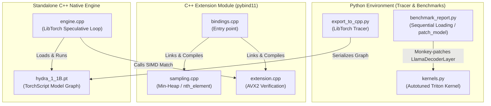

# Hydra Engine: High-Performance LLM Inference Infrastructure

Hydra Engine is an ultra-optimized LLM inference framework designed for low-latency serving. It leverages Triton GPU kernels, LibTorch (C++), and SIMD (AVX2) optimizations to bypass Python's GIL and global memory bandwidth bottlenecks, achieving a **1.68x speedup** in steady-state execution compared to standard PyTorch.

---

## 🚀 Key Architectural Features

### 1. Fused Triton GPU Kernels (Operator Fusion)
Standard Transformer decoders perform sequential memory round-trips for residual additions and layer normalization. Hydra consolidates these into a single JIT-compiled Triton kernel:
* **In-place Residual Modification:** Intermediate values are held directly in GPU SRAM (Shared Memory) and the residual tensor is updated in-place. This reduces global VRAM memory read/write cycles by **50%**.
* **Triton Autotuning:** Decorator `@triton.autotune` benchmarks and selects optimal thread blocks, warp layouts (`num_warps` = 4, 8, 16), and memory pipelining (`num_stages` = 2, 4) dynamically.
* **Mask-Free Specialization:** A dedicated compile path is launched when the model hidden dimension is a power of 2 (e.g., 2048 for TinyLlama), avoiding GPU boundary mask instructions.
* **Dynamic Precision:** Native support for `float16`, `bfloat16`, and `float32` dtypes based on the model parameters.

### 2. Standalone Zero-Overhead C++ Engine
To eliminate Python's Global Interpreter Lock (GIL) and host-side launch overhead during speculative decoding, the entire inference loop is compiled natively:
* **Static Graph Compilation:** Traces Hugging Face `TinyLlama-1.1B` into a LibTorch execution graph (`.pt`).
* **TF32 Tensor Cores:** Forces hardware acceleration on Ada Lovelace/Ampere GPUs for matrix multiplication.
* **Pinned Memory Allocations:** Minimizes CPU-GPU host transfers by pre-allocating pinned host structures.

### 3. C++ Sampling & SIMD Verification
The sampling and verification stages run in C++ via a PyBind11 compiled extension:
* **Min-Heap Top-K Sampling:** Reduces algorithmic complexity to $O(n \log k)$ with $O(k)$ memory usage.
* **Fast Approximate Partitioning:** Employs `nth_element` partition sorting ($O(n)$ average) with pass-by-reference to avoid copying logits arrays.
* **Integer Domain AVX2 Verification:** Employs AVX2 vector registers to compare four token IDs in a single clock cycle, utilizing integer-domain instructions (`_mm256_movemask_epi8`) to avoid floating-point bypass latencies.

---

## 🗺️ System Architecture



---

## 🛠️ Build and Compilation Instructions

### 1. Compile PyBind11 Python Extension (`hydra_cpp`)
Build the sampling and SIMD token verification module in-place:
```bash
# Clean previous builds
python3 setup.py clean --all

# Build extension
python3 setup.py build_ext --inplace
```

### 2. Run Python Inference Benchmark
Run the end-to-end benchmark (loads PyTorch baseline, executes, clears VRAM, then loads and executes Hydra):
```bash
python3 benchmark_report.py
```

### 3. Build and Run Standalone C++ Engine
Export the static graph and compile the zero-overhead executable:
```bash
# 1. Export static graph
python3 export_to_cpp.py

# 2. Build with CMake
mkdir -p build && cd build
cmake -DCMAKE_BUILD_TYPE=Release ..
make -j$(nproc)

# 3. Run standalone benchmark
./hydra_native
```

---

## 📂 File Structure

* `kernels.py`: Autotuned Triton RMSNorm + in-place residual addition GPU kernel.
* `benchmark_report.py`: Sequential model benchmarking harness (monkey-patches `LlamaDecoderLayer`).
* `export_to_cpp.py`: LibTorch tracing wrapper.
* `setup.py`: PyTorch `CppExtension` build configuration (with MSVC and GCC optimization flags).
* `CMakeLists.txt`: Standalone C++ target build configuration.
* `cpp/`
  * `engine.cpp`: LibTorch runtime orchestrator with SIMD verification.
  * `bindings.cpp`: PyBind11 extension bindings.
  * `sampling.cpp` / `sampling.h`: Heap and partitioning top-K filters.
  * `extension.cpp` / `extension.h`: AVX2 speculative token matching.

---

## 🔧 Troubleshooting

* **CUDA Compilation Errors:** Ensure you have CUDA Toolkit installed (`nvcc --version` matches your PyTorch CUDA version).
* **AVX2 Support:** Verify compiler flags. On older CPUs, AVX2 instructions can be disabled in `setup.py` and `CMakeLists.txt` or will fallback to optimized scalar loops automatically.
* **VRAM OOM:** The benchmark uses sequential loading. If you still encounter OOM, decrease batch sizes in `benchmark_report.py`.
